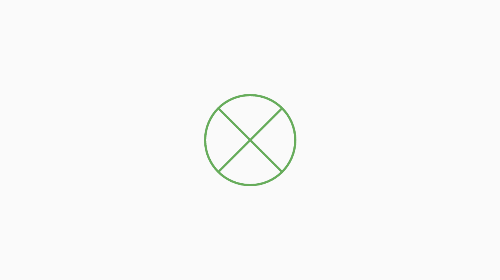

# Circular Placeholder

Preview:

Sample:

> class HomePage extends StatelessWidget {
> @override
> Widget build(BuildContext context) {
>   return Scaffold(
>     body: Center(
>       child: 
>           Container(
>             height: 120,
>             width: 220,    
>             child: CircularPlaceholder(
>               color: Colors.green,
>               strokeWidth: 3,
>           ),
>       ),
>     ),
>   );
> }
>}

